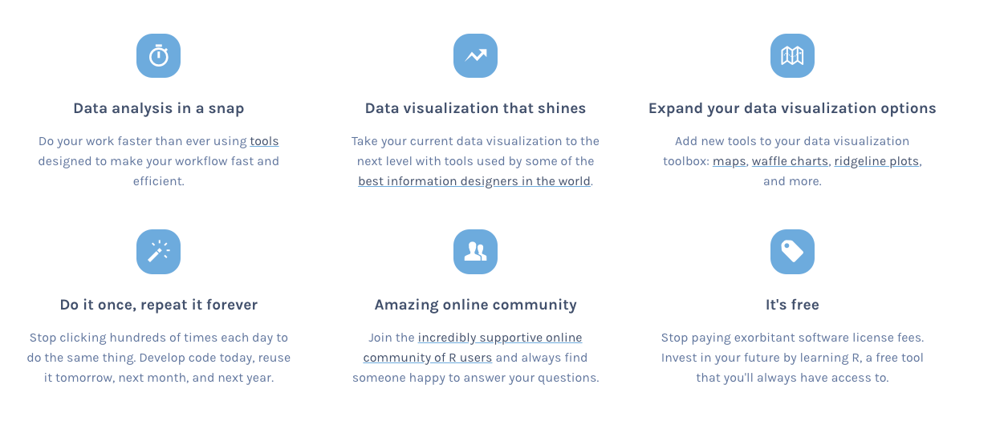
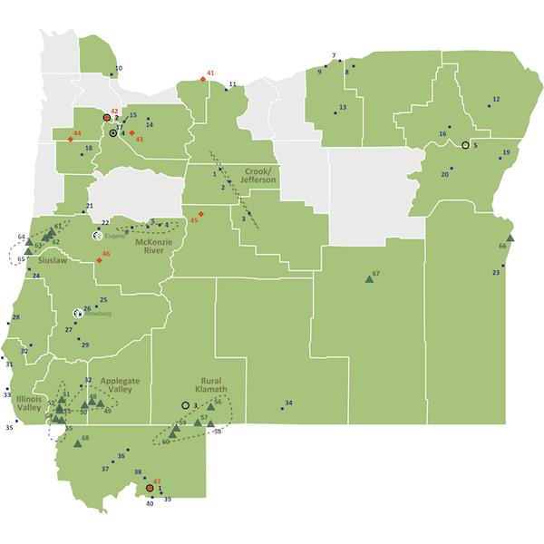
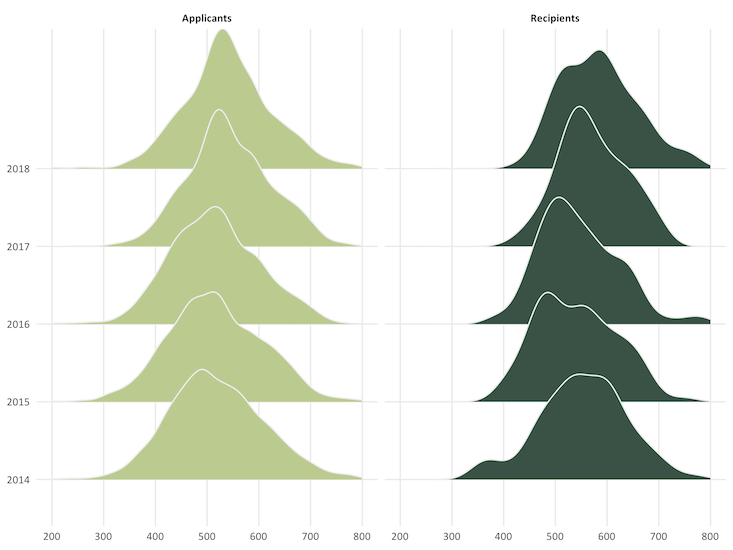
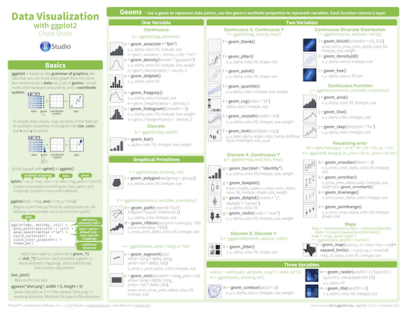
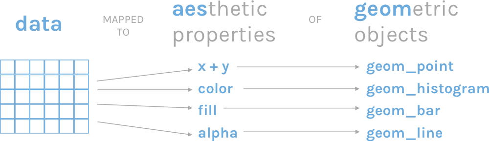

```{r setup, include=FALSE}
knitr::opts_chunk$set(eval = TRUE, 
                      echo = TRUE,
                      warning = FALSE,
                      message = FALSE,
                      rows.print = 5)

library(tidyverse)
library(here)


```

layout: true
  
<div class="dk-footer">
<span>
<a href="https://rfortherestofus.com/" target="_blank">R for the Rest of Us
</a>
</span>
</div> 

---

## Why Use R?

--



---

class: inverse, center, middle, dk-section-title

### Data Visualization

---


class: center, middle


---

class: center, middle



---


class: center, middle




---

class: inverse, center, middle, dk-section-title

### Reproducibility


---

class: inverse, center, middle, dk-section-title 

## What is R?


---

### Download and Install R

The first thing you need to do is download the R software. Go to the [Comprehensive R Archive Network (aka “CRAN”) website](https://cran.cnr.berkeley.edu/) and download the software for your operating system (Windows, Mac, or Linux).


---

### RStudio

--

.center[


.small[Courtesy [Modern Dive](http://moderndive.com/2-getting-started.html#what-are-r-and-rstudio)]
]


---

### Download and Install RStudio

Download RStudio at the [RStudio website](https://www.rstudio.com/products/rstudio/download/#download). Ignore the various versions listed there. All you need is the latest version of RStudio Desktop.


---
class: center, middle, dk-section-title

class: inverse, center, middle, dk-section-title 

# Packages

---

### Packages


--

.center[


.small[Courtesy [Modern Dive](http://moderndive.com/2-getting-started.html#packages)]
]

???


Packages add functionality that is not present in base R. 

They're where much of the power of R is found.

---

class: middle


.pull-left[

.center[

]

]


.pull-right[

### `tidyverse`

The [`tidyverse`](https://tidyverse.org/) is a collection of packages. 

We'll use [`readr`](https://readr.tidyverse.org/) to import data. 

We'll use [`ggplot2`](https://ggplot2.tidyverse.org/) to visualize data. 

]


---

class: inverse, center, middle, dk-section-title 

# Working with Data

---

## Import Data


```{r echo = FALSE}
nhanes <- read_csv(here("data", "nhanes.csv"))
```

```{r eval = FALSE}
nhanes <- read_csv("data/nhanes.csv")
```

--

```{r}
nhanes
```


---

## Data Analysis

```{r eval = FALSE}
nhanes %>% 
  count(education)
```

--

```{r echo = FALSE}
nhanes %>% 
  count(education)
```

---

### Data Analysis

```{r}
physically_active_education <- nhanes %>% 
  group_by(education) %>% 
  summarize(days_active = mean(phys_active_days, na.rm = TRUE)) %>% 
  mutate(days_active = round(days_active, 1)) %>% 
  drop_na(education)
```

--

```{r echo = FALSE}
physically_active_education
```


---

class: center, middle, inverse, dk-section-title

# Data Viz

---

## ggplot

.center[

]

---

## The Grammar of Graphics

--

.center[

]

---

## Facets


---

## Themes


